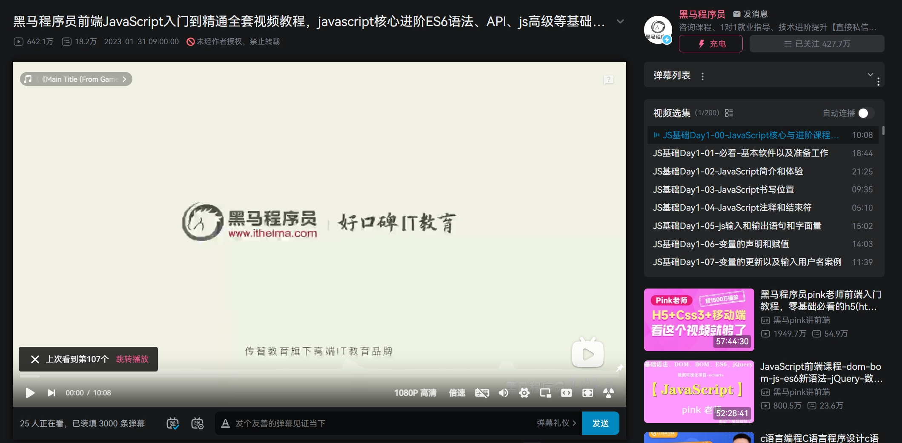
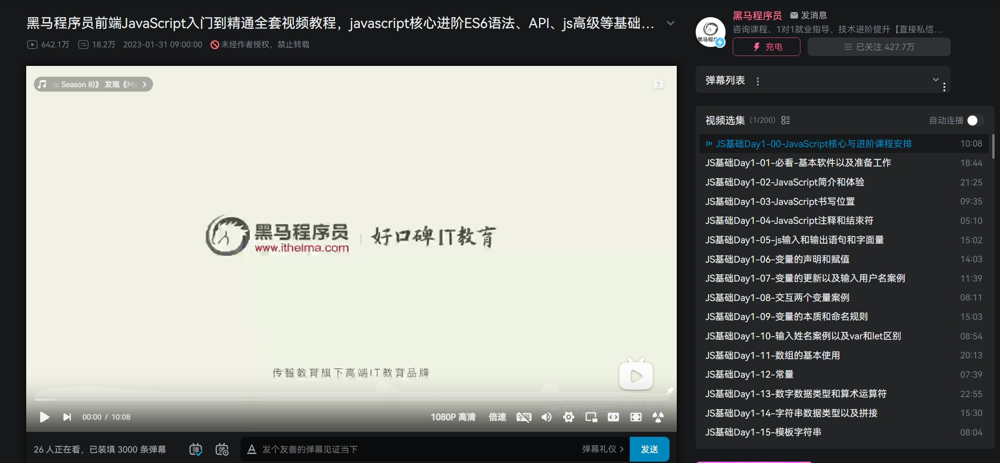

## 介绍
B站网页端默认的视频选集列表尺寸有点小
因此写了一个油猴脚本，用于修改右侧视频选集列表的宽度、最大高度

生效的页面:
- 普通视频页面（`www.bilibili.com/video/*`）
- 番剧页面（`www.bilibili.com/bangumi/*`）

## 使用
此脚本没有在 greasyfork 上发布，主要是我懒
使用前确保自己安装了 Tampermonkey 插件，打开插件菜单选择【添加新脚本】，然后将代码拷进去保存即可

播放列表的默认最大高度为250px，脚本中最大高度改为了500px，宽度改为了450px。可根据自己的习惯，直接修改代码里的超参 `MAX_HEIGHT`、`WIDTH`

## 实际效果对比

修改前：

修改后：
